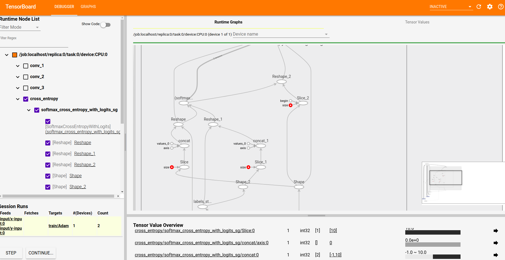

# Deep-Learning-Tensorflow
Purely Tensorflow, no Keras, no slim or other abstract libraries of Tensorflow. This repository focused on not-really deep architecture.

## Requirements
  * NumPy
  * TensorFlow >= 1.0
  * matplotlib
  * scipy
  * Python 3.X

## Information

Some of notebooks got GIF showing training movement. WARNING, it pretty heavy.

## Models

#### Convolutional Neural Network

1. Scratch Alex-net CIFAR 10
2. Capsule Network
3. Encoder-Decoder
4. Residual Network
5. Basic Conv on MNIST
6. Byte-Net Translator
7. Siamese Network on MNIST
8. Generalized Hamming Network on MNIST
9. Binary-net
10. Kmax Conv1d
11. Temporal Conv1d
12. Triplet loss on MNIST
13. Dense-net

#### Feed-forward

1. Batch-normalization
2. Encoder-Decoder
3. Word Vector
4. Dropout Comparison, GIF included
5. L1, L2, L1-L2 Regularization Comparison, GIF included
6. Optimizer Comparison (Gradient Descent, Adagrad, RMSProp, Adam), GIF included
7. Batch-normalization Comparison, GIF included
8. Self-Normalized without and with API on MNIST
9. Addsign and Powersign Optimizer
10. Backprop without Learning Rates Through Coin Betting Optimizer (COCOB)

#### Recurrent Neural Network

1. Music Generator
2. Stock forecasting, GIF included
3. Text Generator
4. [Text Classifier](https://github.com/huseinzol05/Emotion-Classification-Comparison)
5. [Signal Classifier](https://github.com/huseinzol05/Sound-Classification-Comparison)
6. Generator Comparison (LSTM GRU, LSTM Bidirectional, GRU Bidirectional), GIF included
7. Time-Aware Long-Short Term Memory
8. Dilated RNN
9. Layer-Norm LSTM
10. Neural Turing Machine
11. Only Attention
12. Multihead Attention
13. Fast-slow LSTM
14. Siamese Network
15. Nested LSTM
16. DNC (Differentiable Neural Computer)

### Attention Model
1. Bahdanau
2. Luong

#### Sequence-to-Sequence Model

1. Basic Seq-to-Seq
2. Beam decoder
3. Chatbot with Attention (old API)
4. Summarization with Attention (old API)
5. Luong attention
6. Bahdanau attention
7. Bidirectional
8. Estimator
9. Altimatum (bidirectional + lstm + luong + beam)

#### Static optimized using Bayesian Optimization

1. Conv-CIFAR10
2. Feedforward-Iris
3. Recurrent-Sentiment
4. Conv-Iceberg

#### Regression

1. Linear Regression, GIF included
2. Polynomial Regression, GIF included
3. Ridge Regression, GIF included
4. Lasso Regression, GIF included
5. Elastic-net Regression, GIF included
6. Sigmoid Regression, GIF included

#### [Reinforcement-learning](https://github.com/huseinzol05/Reinforcement-Learning-Agents)

1. Policy gradient
2. Q-learning
3. Double Q-learning
4. Recurrent-Q-learning
5. Double Recurrent-Q-learning
6. Dueling Q-learning
7. Dueling Recurrent-Q-learning
8. Double Dueling Q-learning
9. Double Dueling Recurrent-Q-learning
10. Actor-Critic
11. Actor-Critic Dueling
12. Actor-Critic Recurrent
13. Actor-Critic Dueling Recurrent
14. Async Q-learning

#### Generative Adversarial Network

1. DCGAN
2. DiscoGAN
3. Basic GAN
4. WGAN-improve

#### Misc

1. RNN-LSTM 20newsgroup Tensorboard histrogram
2. Tensorboard debugger
3. Transfer learning emotion dataset on MobilenetV2
4. Multiprocessing tfrecords
5. TF-Serving

## Results

tensorboard debugger

gradient techniques comparison

feed-forward, not dropout vs dropout

